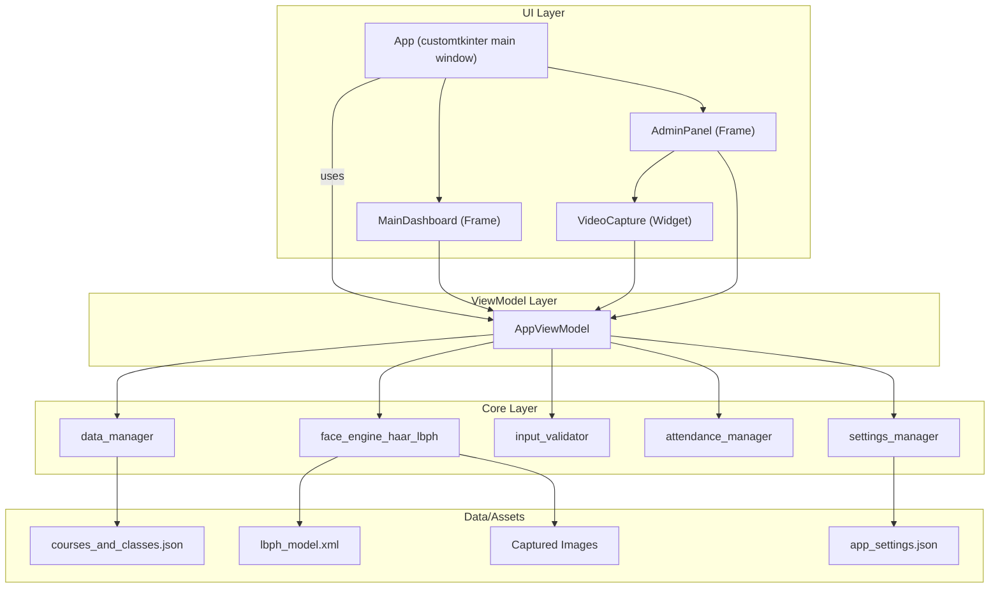

# BÁO CÁO DỰ ÁN: CheckinEdu - Hệ Thống Điểm Danh AI

## 1. Giới thiệu
CheckinEdu là hệ thống điểm danh tự động sử dụng nhận diện khuôn mặt, xây dựng bằng Python, CustomTkinter và OpenCV. Hệ thống hỗ trợ quản lý khóa học, lớp học, đăng ký sinh viên bằng hình ảnh và điểm danh qua camera, giúp tự động hóa quá trình điểm danh trong môi trường giáo dục.

---

## 2. Mục tiêu & Yêu cầu bài tập

- Tự động hóa điểm danh sinh viên bằng nhận diện khuôn mặt.
- Sử dụng webcam để stream video vào máy tính (đáp ứng F1).
- Cắt video thành các frame ảnh, xử lý và nhận diện khuôn mặt (F2, F3, F4).
- Giao diện trực quan, dễ sử dụng cho cả quản trị viên và sinh viên.

---

## 3. Mapping chức năng với mã nguồn (FUNCTION MAP)

### 3.1. Function 1: Stream video từ webcam (F1)
- **Yêu cầu:** Stream video từ camera vào máy tính (webcam được phép).
- **Đáp ứng:** Đã đáp ứng.
- **File:** `src/ui/widgets/video_capture.py`
  - `VideoCapture` class: Quản lý webcam, đọc frame qua `cv2.VideoCapture(self.view_model.camera_index)`, hiển thị lên UI.
  - `start_capture()`, `_update_frame()`.

### 3.2. Function 2: Cắt video thành frame ảnh (F2)
- **Yêu cầu:** Cắt video thành frame, lấy ảnh khuôn mặt.
- **Đáp ứng:** Đã đáp ứng.
- **File:** 
  - `src/ui/app_view_model.py`: `capture_image_for_enrollment()` - lấy frame, phát hiện và cắt khuôn mặt.
  - `src/core/face_engine_haar_lbph.py`: `train_from_folder()` - đọc ảnh, cắt lại khuôn mặt nếu cần.

### 3.3. Function 3: Phát hiện khuôn mặt (F3)
- **Yêu cầu:** Phát hiện vị trí khuôn mặt trên ảnh.
- **Đáp ứng:** Đã đáp ứng.
- **File:** 
  - `src/core/face_engine_haar_lbph.py`: `detect_faces()`.
  - `src/ui/app_view_model.py`: gọi `detect_faces()` trong `capture_image_for_enrollment()` và `_recognition_worker()`.

### 3.4. Function 4: Nhận diện khuôn mặt (F4)
- **Yêu cầu:** Nhận diện mã sinh viên, tên, thời gian điểm danh.
- **Đáp ứng:** Đã đáp ứng.
- **File:** 
  - `src/core/face_engine_haar_lbph.py`: `recognize_face()`.
  - `src/ui/app_view_model.py`: `_recognition_worker()` gọi `recognize_face()`, xác nhận, ghi log qua `attendance_manager.log_attendance()`.
  - `src/core/attendance_manager.py`: `log_attendance()` ghi file CSV.

### 3.5. Pre-processing (Tiền xử lý ảnh)
- **Yêu cầu:** Cân bằng sáng, lọc nhiễu, v.v.
- **Đáp ứng:** Đã đáp ứng.
- **File:** 
  - `src/core/face_engine_haar_lbph.py`: `preprocess_face()` - chuyển grayscale, resize, equalize, blur, sharpen.

---

## 4. Kiến trúc & Cấu trúc mã nguồn

### Sơ đồ tổng quan hệ thống

**Giải thích kiến trúc:**

- **UI Layer**: Cửa sổ chính (`App`) quản lý hai frame chính: `MainDashboard` và `AdminPanel`. `AdminPanel` sử dụng widget `VideoCapture` để truy cập camera.
- **ViewModel Layer**: `AppViewModel` là cầu nối giữa giao diện và logic nghiệp vụ, quản lý trạng thái, luồng xử lý và giao tiếp với các module core.
- **Core Layer**: Chứa các module xử lý dữ liệu, nhận diện khuôn mặt, kiểm tra đầu vào, ghi log điểm danh và quản lý cấu hình.
- **Data/Assets**: Lưu trữ dữ liệu, model nhận diện và ảnh đã chụp.

Kiến trúc này đảm bảo phân tách rõ ràng giữa giao diện, logic và dữ liệu, giúp hệ thống dễ bảo trì và mở rộng.

### Cấu trúc thư mục chính
- **main.py**: Khởi động ứng dụng, điều phối giao diện.
- **src/core/**: Xử lý logic nghiệp vụ.
- **src/ui/**: Giao diện người dùng.
- **data/system_data/**: Lưu cấu hình, dữ liệu khóa/lớp, model nhận diện.
- **assets/**: Ảnh, font chữ.
- **docs/**: Tài liệu dự án.

---

## 5. Chức năng & Quy trình xử lý chi tiết

### 5.1. Quản lý khóa học, lớp học
- Thêm, xóa, chỉnh sửa khóa học và lớp học qua giao diện quản trị.
- Dữ liệu lưu trữ ở file JSON.
- *(Chèn ảnh giao diện quản lý khóa/lớp tại đây)*

### 5.2. Đăng ký sinh viên bằng hình ảnh
- Quản trị viên nhập thông tin sinh viên, chọn lớp, nhấn "Add Student".
- Hệ thống hướng dẫn 6 bước (nhìn thẳng, cười, quay trái/phải, nhìn lên/xuống).
- Mỗi bước chụp 5 ảnh, tổng 30 ảnh/sinh viên.
- Overlay hướng dẫn luôn hiển thị ở trên cùng, tiến trình số ảnh ở dưới, cảnh báo (ví dụ không phát hiện khuôn mặt) ở giữa màn hình.
- Ảnh được lưu vào thư mục riêng cho từng sinh viên, phục vụ huấn luyện nhận diện.
- *(Chèn ảnh giao diện đăng ký sinh viên, overlay hướng dẫn, tiến trình tại đây)*

### 5.3. Huấn luyện lại mô hình nhận diện
- Sau khi có sinh viên mới, quản trị viên nhấn "Re-Train Model".
- Hệ thống quét thư mục ảnh, phát hiện và tiền xử lý khuôn mặt, huấn luyện lại mô hình LBPH, lưu model và label map.
- *(Chèn ảnh/thông báo huấn luyện tại đây)*

### 5.4. Điểm danh tự động qua camera
- Người dùng chọn khóa học, lớp, nhấn "Start Attendance".
- Camera nhận diện khuôn mặt, so sánh với dữ liệu đã huấn luyện.
- Nếu nhận diện thành công và đủ số lần xác nhận, hệ thống ghi log điểm danh vào file CSV, tránh trùng lặp.
- Overlay hiển thị trạng thái nhận diện, tiến trình xác nhận, và thông tin sinh viên.
- *(Chèn ảnh giao diện điểm danh, overlay nhận diện tại đây)*

---

## 6. Thuật toán & Xử lý kỹ thuật

- **Phát hiện khuôn mặt:** Haar Cascade (OpenCV) - `detect_faces()`.
- **Tiền xử lý:** Grayscale, cân bằng histogram, sharpen, resize - `preprocess_face()`.
- **Nhận diện:** LBPH (OpenCV), lưu model XML và label map PKL - `recognize_face()`.
- **Đa luồng:** Nhận diện chạy trên thread riêng, cập nhật kết quả lên UI theo thời gian thực.
- **Lưu trữ:** Dữ liệu khóa/lớp (JSON), log điểm danh (CSV), model (XML, PKL).

---

## 7. Dữ liệu sử dụng

- Ảnh khuôn mặt sinh viên (tự thu thập khi đăng ký).
- Dữ liệu khóa học, lớp học lưu ở JSON.
- Log điểm danh lưu theo ngày, theo lớp, dưới dạng CSV.
- *(Chèn ảnh ví dụ dữ liệu tại đây)*

---

## 8. Giao diện & Trải nghiệm người dùng

- CustomTkinter hiện đại, dễ dùng.
- Overlay hướng dẫn (trên), tiến trình (dưới), cảnh báo (giữa) tách biệt, rõ ràng.
- Thao tác quản trị có xác nhận/thông báo.
- *(Chèn ảnh tổng quan giao diện tại đây)*

---

## 9. Đánh giá & Hạn chế

- **Ưu điểm:** Tự động hóa, giao diện thân thiện, overlay trực quan, dễ mở rộng, xử lý ảnh hiệu quả.
- **Hạn chế:** Nhận diện phụ thuộc chất lượng ảnh, ánh sáng; chưa hỗ trợ nhiều camera; chưa có phân quyền nâng cao.

---

## 10. Hướng phát triển

- Hỗ trợ nhiều camera, nhiều điểm danh song song.
- Cải thiện thuật toán nhận diện (deep learning).
- Thêm phân quyền, báo cáo thống kê.
- Tích hợp với hệ thống quản lý trường học.

---

## 11. Kết luận

CheckinEdu là hệ thống điểm danh AI hoàn chỉnh, dễ sử dụng, dễ mở rộng, phù hợp triển khai thực tế trong môi trường giáo dục. Dự án đáp ứng đầy đủ các yêu cầu của bài tập CPV301, với từng chức năng đều được mapping rõ ràng vào mã nguồn.