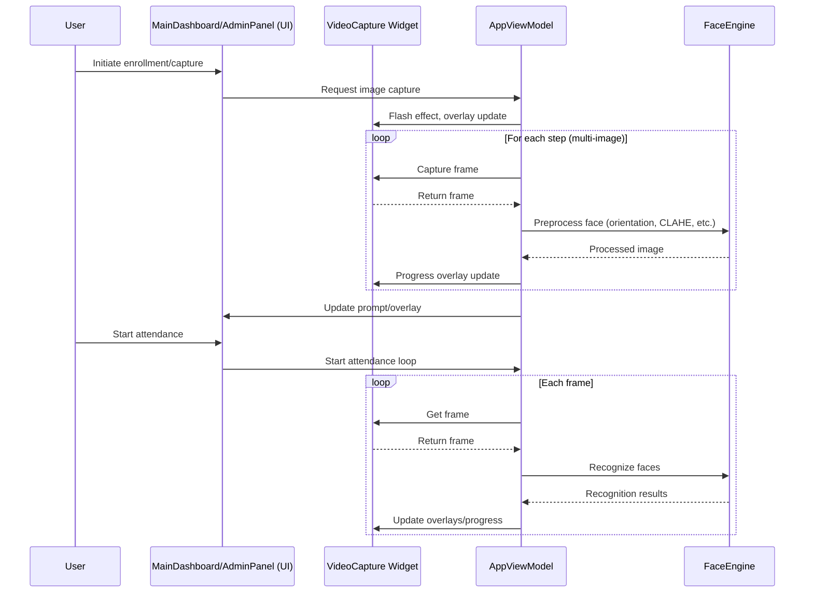

# BÁO CÁO DỰ ÁN: CheckinEdu - Hệ Thống Điểm Danh AI

## 1. Giới thiệu
CheckinEdu là hệ thống điểm danh tự động sử dụng nhận diện khuôn mặt, xây dựng bằng Python, CustomTkinter và OpenCV. Hệ thống hỗ trợ quản lý khóa học, lớp học, đăng ký sinh viên bằng hình ảnh và điểm danh qua camera, giúp tự động hóa quá trình điểm danh trong môi trường giáo dục.

---

## 2. Mục tiêu & Yêu cầu bài tập

- Tự động hóa điểm danh sinh viên bằng nhận diện khuôn mặt.
- Sử dụng webcam để stream video vào máy tính (đáp ứng F1).
- Cắt video thành các frame ảnh, xử lý và nhận diện khuôn mặt (F2, F3, F4).
- Giao diện trực quan, dễ sử dụng cho cả quản trị viên và sinh viên.

---

## 3. Mapping chức năng với mã nguồn (FUNCTION MAP)

### 3.1. Function 1: Stream video từ webcam (F1)
- **Yêu cầu:** Stream video từ camera vào máy tính (webcam được phép).
- **Đáp ứng:** Đã đáp ứng.
- **File:** `src/ui/widgets/video_capture.py`
  - `VideoCapture` class: Quản lý webcam, đọc frame qua `cv2.VideoCapture(self.view_model.camera_index)`, hiển thị lên UI.
  - `start_capture()`, `_update_frame()`.

### 3.2. Function 2: Cắt video thành frame ảnh (F2)
- **Yêu cầu:** Cắt video thành frame, lấy ảnh khuôn mặt.
- **Đáp ứng:** Đã đáp ứng.
- **File:** 
  - `src/ui/app_view_model.py`: `capture_image_for_enrollment()` - lấy frame, phát hiện và cắt khuôn mặt.
  - `src/core/face_engine_haar_lbph.py`: `train_from_folder()` - đọc ảnh, cắt lại khuôn mặt nếu cần.

### 3.3. Function 3: Phát hiện khuôn mặt (F3)
- **Yêu cầu:** Phát hiện vị trí khuôn mặt trên ảnh.
- **Đáp ứng:** Đã đáp ứng.
- **File:** 
  - `src/core/face_engine_haar_lbph.py`: `detect_faces()`.
  - `src/ui/app_view_model.py`: gọi `detect_faces()` trong `capture_image_for_enrollment()` và `_recognition_worker()`.

**Giải thích chi tiết:**
Chức năng phát hiện khuôn mặt sử dụng thuật toán **Haar Cascade**, một phương pháp cổ điển nhưng hiệu quả và nhanh chóng, được tích hợp sẵn trong thư viện OpenCV.

- **Cách hoạt động:** Haar Cascade hoạt động bằng cách quét một cửa sổ nhỏ trên ảnh và áp dụng các bộ phân loại (classifiers) được huấn luyện để tìm kiếm các đặc trưng giống khuôn mặt (như vùng mắt, mũi, miệng). Nếu một vùng vượt qua tất cả các bộ phân loại, nó được coi là một khuôn mặt.

- **Tham số của `detect_faces()`:**
    - `scaleFactor=1.1`: Quy định mức độ giảm kích thước ảnh sau mỗi lần quét (10%).
    - `minNeighbors=4`: Số lượng "hàng xóm" tối thiểu mà một vùng ứng cử viên phải có để được coi là một khuôn mặt.
    - `minSize=(50, 50)`: Kích thước tối thiểu của khuôn mặt được phát hiện (rộng x cao).

### 3.4. Function 4: Nhận diện khuôn mặt (F4)
- **Yêu cầu:** Nhận diện mã sinh viên, tên, thời gian điểm danh.
- **Đáp ứng:** Đã đáp ứng.
- **File:** 
  - `src/core/face_engine_haar_lbph.py`: `recognize_face()`.
  - `src/ui/app_view_model.py`: `_recognition_worker()` gọi `recognize_face()`, xác nhận, ghi log qua `attendance_manager.log_attendance()`.
  - `src/core/attendance_manager.py`: `log_attendance()` ghi file CSV.

**Giải thích chi tiết:**
Chức năng nhận diện khuôn mặt sử dụng thuật toán **Local Binary Patterns Histograms (LBPH)**, một thuật toán nhận diện khuôn mặt mạnh mẽ và hiệu quả, đặc biệt phù hợp với các hệ thống yêu cầu tốc độ xử lý nhanh và không cần đến các mô hình Deep Learning phức tạp.

- **Cách hoạt động:** LBPH hoạt động dựa trên việc phân tích các mẫu texture cục bộ trên khuôn mặt. Nó chia ảnh khuôn mặt thành các vùng nhỏ, sau đó tính toán một "mô tả" (descriptor) cho từng vùng dựa trên sự so sánh độ sáng của pixel trung tâm với các pixel lân cận. Các mô tả này được tổng hợp thành một biểu đồ (histogram) duy nhất đại diện cho khuôn mặt. Khi nhận diện, thuật toán so sánh biểu đồ của khuôn mặt mới với các biểu đồ đã lưu trong cơ sở dữ liệu để tìm ra khuôn mặt khớp nhất.

- **Tham số của `cv2.face.LBPHFaceRecognizer_create()`:**
    - `radius=1`: Xác định bán kính của vòng tròn được sử dụng để lấy mẫu các pixel lân cận khi tính toán Local Binary Pattern. Giá trị `1` là mặc định.
    - `neighbors=8`: Xác định số lượng điểm mẫu trên vòng tròn có bán kính `radius`. Giá trị `8` là mặc định.
    - `grid_x=8`, `grid_y=8`: Xác định số lượng ô (cells) mà ảnh khuôn mặt được chia thành theo chiều ngang và chiều dọc. Giá trị `(8,8)` là mặc định.

- **Ngưỡng tin cậy (`confidence_threshold`) và ánh xạ:**
    - Trong LBPH, giá trị `confidence` (độ tin cậy) thực chất là một **khoảng cách (distance)**. Giá trị `confidence` càng **nhỏ** thì độ khớp càng **cao**.
    - Hệ thống sử dụng một `confidence_threshold` (ngưỡng tin cậy) để xác định xem một khuôn mặt có được nhận diện là "Đã biết" hay "Không xác định". Ngưỡng này được ánh xạ từ thanh trượt "Recognition Sensitivity" trên giao diện người dùng (từ 0.4 đến 0.7, tương ứng với khoảng cách từ 50 đến 100). Khi giá trị `confidence` của kết quả dự đoán nhỏ hơn ngưỡng này, khuôn mặt được coi là khớp.

### 3.5. Pre-processing (Tiền xử lý ảnh)
- **Yêu cầu:** Cân bằng sáng, lọc nhiễu, v.v.
- **Đáp ứng:** Đã đáp ứng.
- **File:** 
  - `src/core/face_engine_haar_lbph.py`: `preprocess_face()`

**Giải thích chi tiết:**
Quá trình tiền xử lý ảnh là bước cực kỳ quan trọng để chuẩn bị dữ liệu đầu vào cho thuật toán nhận diện, giúp tăng cường chất lượng ảnh và giảm thiểu các yếu tố gây nhiễu. Các bước tiền xử lý được thực hiện trong hàm `preprocess_face()`:

1.  **Chuyển đổi sang ảnh xám (Grayscale Conversion):**
    - **Cách hoạt động:** Ảnh màu (BGR) được chuyển đổi thành ảnh đơn kênh màu xám. Điều này giúp giảm lượng dữ liệu cần xử lý mà không làm mất đi các thông tin quan trọng về cấu trúc khuôn mặt, vì thuật toán LBPH chủ yếu dựa vào cường độ điểm ảnh.
    - **Lý do:** Giảm độ phức tạp tính toán và loại bỏ ảnh hưởng của màu sắc, giúp thuật toán tập trung vào các đặc trưng hình thái.

2.  **Thay đổi kích thước (Resizing):**
    - **Cách hoạt động:** Khuôn mặt đã được cắt ra sẽ được thay đổi kích thước về một kích thước chuẩn là `(150, 150)` pixels (`FACE_SIZE`).
    - **Lý do:** Đảm bảo tất cả các khuôn mặt đầu vào cho thuật toán nhận diện đều có cùng kích thước, giúp mô hình huấn luyện và dự đoán nhất quán hơn, đồng thời chuẩn hóa dữ liệu bất kể khoảng cách chụp.

3.  **Cân bằng biểu đồ thích ứng cục bộ (CLAHE - Contrast Limited Adaptive Histogram Equalization):**
    - **Cách hoạt động:** CLAHE là một kỹ thuật nâng cao độ tương phản hình ảnh. Thay vì áp dụng cân bằng biểu đồ trên toàn bộ ảnh (có thể làm tăng nhiễu ở các vùng tối), CLAHE chia ảnh thành các vùng nhỏ (tiles), sau đó áp dụng cân bằng biểu đồ cho từng vùng. `clipLimit` giới hạn mức độ tăng tương phản để tránh khuếch đại nhiễu.
    - **Lý do:** Giúp cải thiện độ tương phản cục bộ của khuôn mặt, đặc biệt hiệu quả trong điều kiện ánh sáng không đồng đều (ví dụ: có bóng đổ, ngược sáng). Điều này làm nổi bật các chi tiết quan trọng trên khuôn mặt, giúp thuật toán nhận diện hoạt động tốt hơn.
    - **Tham số:**
        - `clipLimit=3.0`: Giá trị này kiểm soát mức độ giới hạn tương phản. Giá trị `3.0` được chọn để tăng cường độ tương phản một cách mạnh mẽ hơn so với giá trị mặc định (`2.0`), giúp làm rõ các đặc trưng khuôn mặt trong môi trường ánh sáng phức tạp như phòng học, nơi có thể có nhiều nguồn sáng và bóng đổ.
        - `tileGridSize=(8,8)`: Kích thước của lưới mà ảnh được chia thành để áp dụng cân bằng biểu đồ cục bộ. Giá trị `(8,8)` là mặc định và phù hợp để xử lý các chi tiết cục bộ trên khuôn mặt.

4.  **Làm mờ Gaussian (Gaussian Blur):**
    - **Cách hoạt động:** Áp dụng một bộ lọc Gaussian với kích thước kernel `(3, 3)` để làm mờ ảnh một cách nhẹ nhàng.
    - **Lý do:** Giảm nhiễu ngẫu nhiên (noise) trong ảnh, giúp làm mịn các chi tiết không mong muốn và làm nổi bật các đặc trưng chính của khuôn mặt, từ đó cải thiện độ chính xác của nhận diện.

---

## 4. Kiến trúc & Cấu trúc mã nguồn

### Sơ đồ tổng quan hệ thống

**Giải thích kiến trúc:**

Hệ thống được xây dựng dựa trên kiến trúc MVVM (Model-View-ViewModel), được thể hiện rõ qua sơ đồ tuần tự (sequence diagram) ở trên. Kiến trúc này phân tách rõ ràng các thành phần, giúp hệ thống trở nên module hóa và dễ bảo trì.

*   **User (Người dùng):** Là tác nhân tương tác với hệ thống.
*   **MainDashboard/AdminPanel (UI - View):** Là lớp giao diện người dùng, nơi tiếp nhận các hành động của người dùng (như nhấn nút "Start Attendance" hoặc "Capture"). Giao diện không chứa logic xử lý phức tạp mà chỉ ủy thác các yêu cầu cho `AppViewModel`.
*   **VideoCapture Widget (View):** Là một thành phần UI chuyên biệt, chịu trách nhiệm hiển thị luồng video từ camera và các lớp phủ đồ họa (overlays) như khung nhận diện, hiệu ứng, và thanh tiến trình. Widget này được điều khiển trực tiếp bởi `AppViewModel`.
*   **AppViewModel (ViewModel):** Đóng vai trò là "bộ não" trung tâm, điều phối mọi hoạt động của ứng dụng. Nó làm cầu nối giữa View (UI) và Model (`FaceEngine`). `AppViewModel` quản lý trạng thái của ứng dụng (ví dụ: đang điểm danh hay đang đăng ký), xử lý logic luồng đi và giao tiếp với các thành phần khác.
    *   **Trong luồng đăng ký (Enrollment):** `AppViewModel` yêu cầu `VideoCapture` chụp ảnh, gửi ảnh đến `FaceEngine` để tiền xử lý, và cập nhật lại giao diện với tiến trình và hướng dẫn.
    *   **Trong luồng điểm danh (Attendance):** `AppViewModel` chạy một vòng lặp liên tục, lấy frame từ `VideoCapture`, yêu cầu `FaceEngine` nhận diện, và sau đó cập nhật kết quả lên `VideoCapture` dưới dạng overlays.
*   **FaceEngine (Model):** Là lõi xử lý nghiệp vụ, chịu trách nhiệm cho tất cả các tác vụ thị giác máy tính nặng. Nó thực hiện việc tiền xử lý ảnh (cân bằng sáng, CLAHE) và nhận diện khuôn mặt. `FaceEngine` hoạt động hoàn toàn độc lập với giao diện người dùng.

Kiến trúc này đảm bảo rằng logic xử lý (trong `AppViewModel` và `FaceEngine`) được tách biệt hoàn toàn khỏi giao diện (trong `UI` và `Widget`), giúp việc phát triển, kiểm thử và nâng cấp từng thành phần trở nên dễ dàng hơn.

### Cấu trúc thư mục chính
- **main.py**: Khởi động ứng dụng, điều phối giao diện.
- **src/core/**: Xử lý logic nghiệp vụ.
- **src/ui/**: Giao diện người dùng.
- **data/system_data/**: Lưu cấu hình, dữ liệu khóa/lớp, model nhận diện.
- **assets/**: Ảnh, font chữ.
- **docs/**: Tài liệu dự án.

---

## 5. Chức năng & Quy trình xử lý chi tiết

### 5.1. Quản lý khóa học, lớp học
- Thêm, xóa, chỉnh sửa khóa học và lớp học qua giao diện quản trị.
- Dữ liệu lưu trữ ở file JSON.
- *(Chèn ảnh giao diện quản lý khóa/lớp tại đây)*

### 5.2. Đăng ký sinh viên bằng hình ảnh
- Quản trị viên nhập thông tin sinh viên, chọn lớp, nhấn "Add Student".
- Hệ thống hướng dẫn 6 bước (nhìn thẳng, cười, quay trái/phải, nhìn lên/xuống).
- Mỗi bước chụp 10 ảnh, tổng 60 ảnh/sinh viên. Người dùng cần nhấn phím SPACEBAR 10 lần cho mỗi bước để chụp ảnh. Trong quá trình chụp, khuyến khích người dùng thay đổi nhẹ khoảng cách (bình thường, gần hơn, xa hơn) để tăng tính đa dạng của dữ liệu huấn luyện.
- Overlay hướng dẫn luôn hiển thị ở trên cùng, tiến trình số ảnh ở dưới, cảnh báo (ví dụ không phát hiện khuôn mặt) ở giữa màn hình.
- Ảnh được lưu vào thư mục riêng cho từng sinh viên, phục vụ huấn luyện nhận diện.
- *(Chèn ảnh giao diện đăng ký sinh viên, overlay hướng dẫn, tiến trình tại đây)*

### 5.3. Huấn luyện lại mô hình nhận diện
- Sau khi có sinh viên mới, quản trị viên nhấn "Re-Train Model".
- Hệ thống quét thư mục ảnh, phát hiện và tiền xử lý khuôn mặt, huấn luyện lại mô hình LBPH, lưu model và label map.
- *(Chèn ảnh/thông báo huấn luyện tại đây)*

### 5.4. Điểm danh tự động qua camera
- Người dùng chọn khóa học, lớp, nhấn "Start Attendance".
- Camera nhận diện khuôn mặt, so sánh với dữ liệu đã huấn luyện.
- Nếu nhận diện thành công và đủ số lần xác nhận, hệ thống ghi log điểm danh vào file CSV, tránh trùng lặp.
- Overlay hiển thị trạng thái nhận diện, tiến trình xác nhận, và thông tin sinh viên.
- *(Chèn ảnh giao diện điểm danh, overlay nhận diện tại đây)*

---

## 6. Thuật toán & Xử lý kỹ thuật

- **Phát hiện khuôn mặt:** Haar Cascade (OpenCV) - `detect_faces()`. (Chi tiết tại mục 3.3)
- **Tiền xử lý:** Chuyển grayscale, thay đổi kích thước, cân bằng biểu đồ thích ứng cục bộ (CLAHE), làm mờ Gaussian. (Chi tiết tại mục 3.5)
- **Nhận diện:** LBPH (OpenCV), lưu model XML và label map PKL - `recognize_face()`. (Chi tiết tại mục 3.4)
- **Đa luồng:** Nhận diện chạy trên thread riêng, cập nhật kết quả lên UI theo thời gian thực.
- **Lưu trữ:** Dữ liệu khóa/lớp (JSON), log điểm danh (CSV), model (XML, PKL).

---

## 7. Dữ liệu sử dụng

- Ảnh khuôn mặt sinh viên (tự thu thập khi đăng ký).
- Dữ liệu khóa học, lớp học lưu ở JSON.
- Log điểm danh lưu theo ngày, theo lớp, dưới dạng CSV.
- *(Chèn ảnh ví dụ dữ liệu tại đây)*

---

## 8. Giao diện & Trải nghiệm người dùng

- CustomTkinter hiện đại, dễ dùng.
- Overlay hướng dẫn (trên), tiến trình (dưới), cảnh báo (giữa) tách biệt, rõ ràng.
- Thao tác quản trị có xác nhận/thông báo.
- *(Chèn ảnh tổng quan giao diện tại đây)*

---

## 9. Đánh giá & Hạn chế

- **Ưu điểm:** Tự động hóa, giao diện thân thiện, overlay trực quan, dễ mở rộng, xử lý ảnh hiệu quả.
- **Hạn chế:** Nhận diện phụ thuộc chất lượng ảnh, ánh sáng, và đặc biệt là **khoảng cách**; chưa hỗ trợ nhiều camera; chưa có phân quyền nâng cao.

---

## 10. Hướng phát triển

- Hỗ trợ nhiều camera, nhiều điểm danh song song.
- **Cải thiện thuật toán nhận diện:** Tiếp tục nghiên cứu và thử nghiệm các thuật toán nhận diện khuôn mặt tiên tiến hơn (ví dụ: Fisherfaces, hoặc các phương pháp dựa trên Deep Learning) để nâng cao độ chính xác và khả năng chống chịu với các điều kiện môi trường khác nhau (ánh sáng, góc nhìn, khoảng cách). Đặc biệt, việc tích hợp các kỹ thuật **căn chỉnh khuôn mặt (face alignment)** sẽ là một bước tiến lớn để chuẩn hóa dữ liệu đầu vào, giúp các thuật toán nhận diện hoạt động hiệu quả hơn.
- Thêm phân quyền, báo cáo thống kê.
- Tích hợp với hệ thống quản lý trường học.

---

## 11. Kết luận

CheckinEdu là hệ thống điểm danh AI hoàn chỉnh, dễ sử dụng, dễ mở rộng, phù hợp triển khai thực tế trong môi trường giáo dục. Dự án đáp ứng đầy đủ các yêu cầu của bài tập CPV301, với từng chức năng đều được mapping rõ ràng vào mã nguồn.